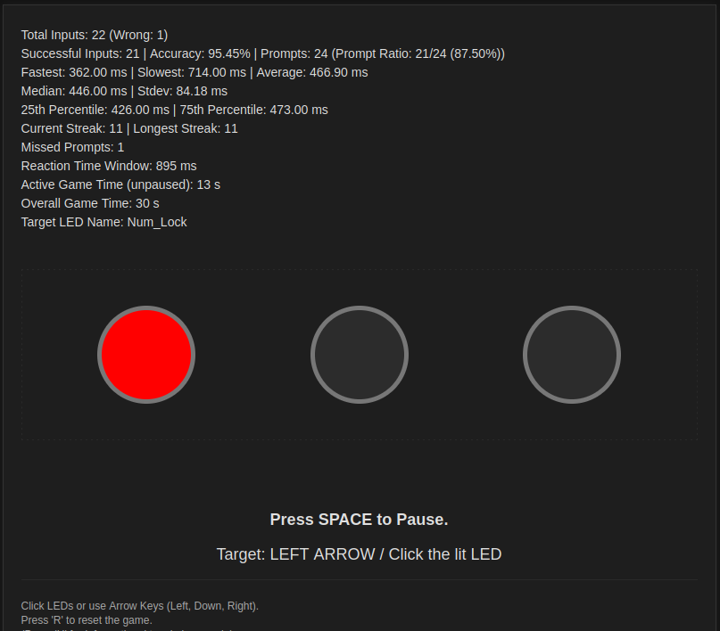

# js_lockkeyreaction

## Play it now: https://pemmyz.github.io/js_lockkeyreaction/

## Screenshots

# LockKeyReaction

A fast-paced LED reaction training game for web browsers! Your task is to respond as fast as possible using arrow keys or by clicking the visual LED circles.

## 🔥 Features

- 🎮 Web-based reaction game originally made for three LED targets: Num Lock, Caps Lock, Scroll Lock
- 🕹️ Controls via arrow keys or LED click
- 📈 Real-time statistics: fastest, slowest, average, median, stdev, accuracy, prompt ratio
- 🌙 Toggle between Light and Dark mode with localStorage memory
- ⏱️ Adaptive difficulty – reaction window shortens over time
- 📊 10-line performance tracker, streak system, missed prompts, total game time
- ♻️ Reset game anytime with `R` key
- ⏸️ Pause and resume with `SPACE` key
- 🧪 Visual-only simulation – no access to physical LED states required

## 🎮 Controls

| Action                  | Key/Button     |
|------------------------|----------------|
| Start/Pause game       | `SPACE`        |
| Reset game             | `R`            |
| Toggle theme           | Top-right ☀️/🌙 button |
| Respond to Num Lock    | `←` Arrow Left |
| Respond to Caps Lock   | `↓` Arrow Down |
| Respond to Scroll Lock | `→` Arrow Right |
| Toggle console info     | `H` (logs info in console) |

You can also click on the lit LED circles directly!

## 🧠 How It Works

- The game lights up a virtual LED at random intervals.
- You must react by pressing the correct key or clicking the correct LED.
- Reaction times are logged and analyzed live.
- The response window gets shorter the longer you play, increasing the difficulty.

